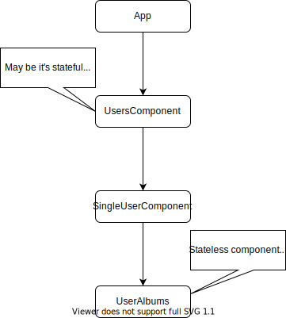
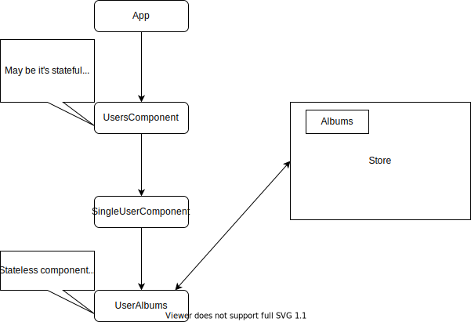

# State Management

# Why State Management?

- Performance
- Testability
- Tooling
- The ability to keep the application predictable 
- Simple to reason about. 
- Decoupled architecture
- Easier Undo/Redo possibility


## Reducer

Change store based on action.


1. Single source of truth

	```
	single place to store your data. you want data look into store
	```

2. Keep component stateless, avoid un-necessary traversing.

	

	`SingleUserComponent` never needs any albums related information but it's have to hold and pass it to children. 

	Bit complex to manage this flow child component just 2-3 level down in tree.

	** Solution to above inter-communication issue **

	

	<div class="card border-info mb-3">
	  <div class="card-header text-info">Caution!</div>
	  <div class="card-body">
	    <p class="card-text">There are situations where components are dependent on each other at completely different points in the component tree, and passing inputs 10 levels up the tree and callback functions 10 levels down the tree then 5 levels up another branch is not scalable in complexity.</p>
	  </div>
	</div>

	<div class="card border-success mb-3">
	  <div class="card-header text-success">So we need store</div>
	  <div class="card-body">
	    <p class="card-text">As it provides a solution for more complex component interaction solution.</p>
	  </div>
	</div>

3. Store provide a client-side cache if needed, to avoid doing repeated Ajax requests.

## Store Concept


# Ngrx

## Setup
```
ng add @ngrx/store
ng add @ngrx/store-devtools

// install Redux devtools chrome extension

ng g store auth/Auth --module auth.module.ts
```


## Create action

```javascript
// user.component.ts
this.store.dispatch({
	type: 'Login',
	payload: {name: 'hemant'}
})
```

Better way to write action..

```javascript
// user.actions.ts
export const login = createFunction(
	'[Login Screen] User Login',
	props<{user: User}>()
);

// action without arguments
export const logout = createFunction(
	'[Login Screen] User Logout'
);
```

## Reducer

```javascript
export interface CounterState {
	count: number;
}

export const initialCounterState: CounterState = 0;
export function counterReducer(state, action): CounterState {
  initialCounterState,
  on(increment, state => state + 1)
}
```

## Query from store

```javascript
const user$ = this.store.pipe(map(user => !user), distinctUntilChanged());

// user.selectors.ts
const user$ = this.store.pipe(map(user => !user), distinctUntilChanged());

// better
export const isUserLoggedIn = createSelector(
	state => state['user'], // select global state
	(user) => user.loggedIn // select specific part
)
```

### Feature Selector

```javascript
exort const selectAuthState = createFeatureSelector<AuthState>('auth');
exort const isLoggedIn = createSelector(
	selectAuthState,
	(user) => user.loggedIn
)
```

## Effects
Do something extra when action is dispatched.

Handle async data, addition of storing data in store also it may store somewhere else ie database, local storage etc.

```javascript
// user.module.ts
@NgModule({
	imports: [
		EffectsModule.forFeature([SideEffects])
	]
})

//user.effects.ts
export class SideEffects {
	constructor(action$: Action) {
		action$.subscribe(action => {
			if (action.type === '[Login Screen] Login') {
				// do something
			}
		});
	}
}

// With manual subscription
export class SideEffects {
	constructor(private action$: Action) {
		login $ = this.action$.pipe(
			ofType(AuthActions.login),
			tap(action => {
				// do something
			});
		);

		login$.subscribe();
	}
}

// Without manual subscription
// dispatch required if not dispatching action from here
export class SideEffects {
	login$ = createEffect( () =>
		this.action$.pipe(
			ofType(AuthActions.login),
			tap(action => {
				// do something
			});
		), {dispatch: false)};

	constructor(private action$: Action) {

	}
}
```

# Resources

- Ultimate NGRX: What is State Management?
https://youtu.be/N_UQx8dPPkc

- Real world angular with ngrx
https://github.com/stefanoslig/angular-ngrx-nx-realworld-example-app

- JS to TS
http://www.jsontots.com/


