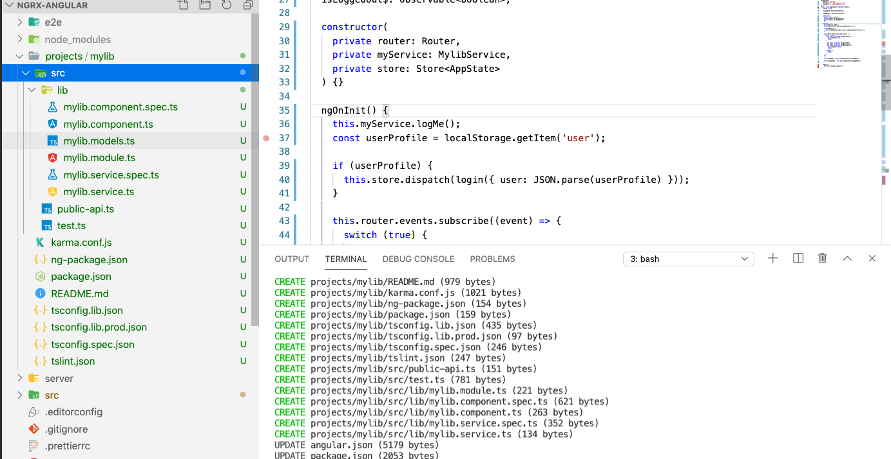

# Organize your angular app with library

```
ng g library mylib --prefix hk
```



## Using library

Import library to your angular module as you do for other modules, now you can use component of library in your component. also you can use services by injecting it in component that you usually do with other services.

```html
// app.component.html
<hk-mylib></hk-mylib>
```

```javascript
// app.component.ts
constructor(
	private myLibService: MylibService,
) {}

ngOnInit() {
	this.myLibService.logMe();
}
```

## Testing

```
ng test mylib
```

## Store

{
	
}