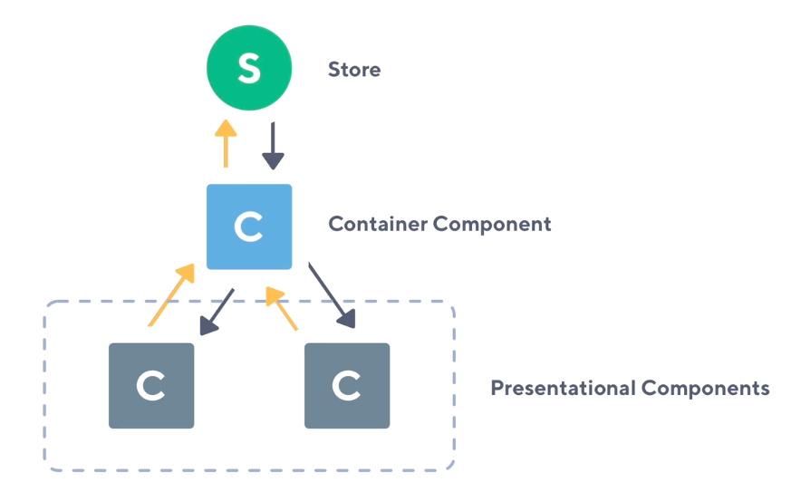
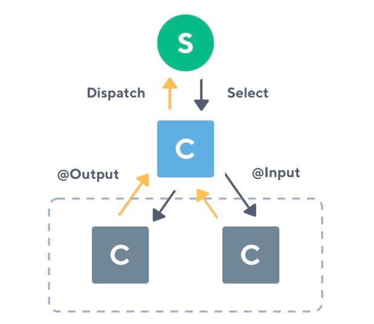

# NGRX

- Redux inspired reactive state management 

```
based on Redux
Written with Observables
Made for Angular
```

## Why NGRX

- Single source of truth
- Testability
- Performance 
- Root & Feature module support	

## Reactive Component architecture - Angular






<div class="row">
	<div class="col">
		<strong>Container</strong>
		<li>
			Aware of store
		</li>
		<li>
			Dispatches Action
		</li>
		<li>
			Read data from store
		</li>
	</div>
	<div class="col">
		<strong>Presentational</strong>
		<li>
			Not aware of store
		</li>
		<li>
			@Output
		</li>
		<li>
			Read data from @Input()
		</li>	
	</div>
</div>

## Runtime checks

Runtime checks are here to guide developers to follow the NgRx and Redux core concepts and best practices

```javascript
@NgModule({
  imports: [
    StoreModule.forRoot(reducers, {
      runtimeChecks: {
        strictStateImmutability: true, // default
        strictActionImmutability: true, // default
        strictStateSerializability: true,
        strictActionSerializability: true,
        strictActionWithinNgZone: true
      },
    }),
  ],
})
export class AppModule {}
```
