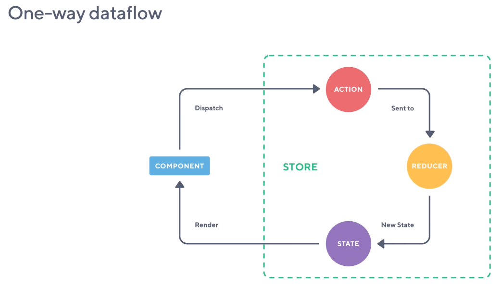

# Redux

3 principal

1. Single Source of truth (single {})
2. State is read only
3. Pure Function

```
- Store
- Action
- Reducer
```



# 1. Single Source of truth (single {})

Updated by reducers

